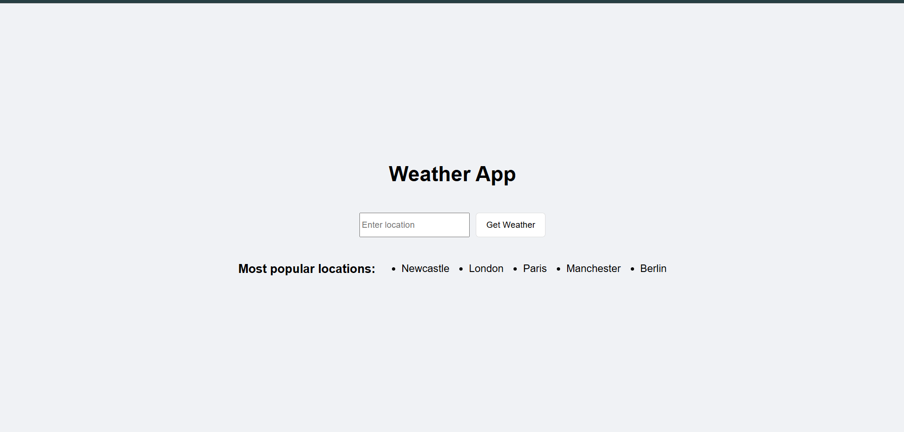
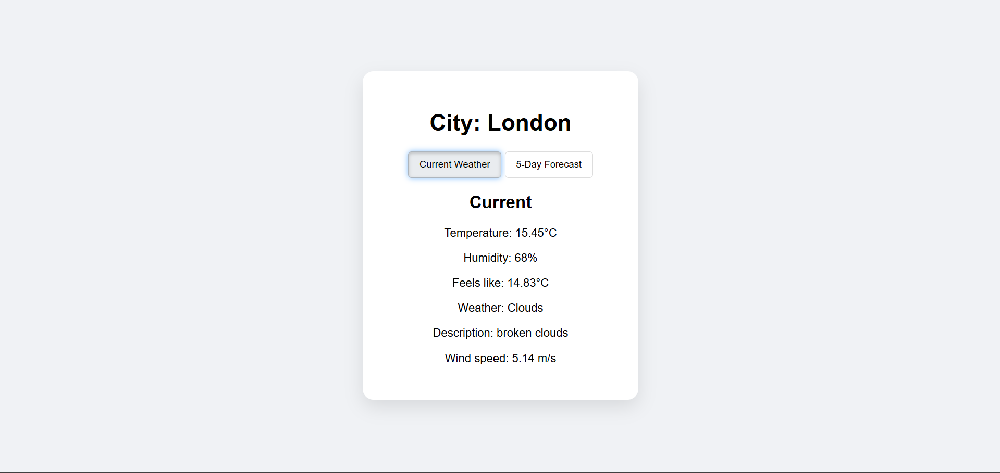
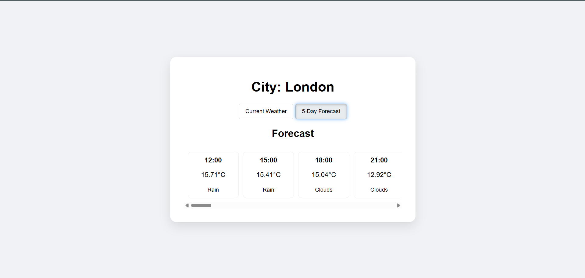

# Weather-app
A full-stack weather application that provides real-time weather data and 5-day forecasts using the OpenWeatherMap API. Implemented a containerized MySQL database to provide search frequency analytics. 

## The search screen 
 

## Current weather display 
 

## Forecasted weather display 

## Features
- Real-time weather: Fetches live data (temperature, humidity,temperature feels like, main weather, weather description, wind speed)
- 5-day forecast in 3 hour intervals (time, temperature, main weather)
- Search analytics: Logs every request to a MySQL database, displays the top 5 most frequent searches globally
- Containerized DB: Used a Dockerized MySQL instance for optimal read operations 
  
## Tech Stack 
- Backend: Java, Spring Boot
- Frontend: HTML, CSS, JavaScript
- Database: MySQL (hosted via Docker) 
- Integration: OpenWeatherMap API via Spring RestTemplate
- Build Tool: Gradle 

## How to run
- Clone this repository
- Start the database
- Configure API key: Generate API key from OpenWeatherMap and add to src/main/resources/application.properties
- Run WeatherAppApplication

## Future improvements 
- Implement redis caching to reduce external API calls for popular locations
- Provide more error handling 
